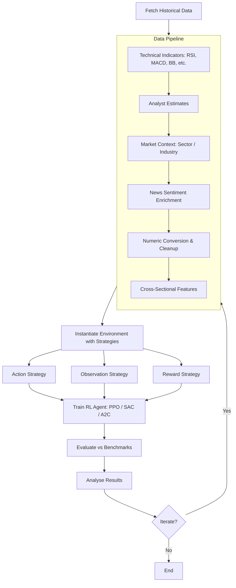

# QuantRL-Lab

[](https://badge.fury.io/py/quantrl-lab)
[](https://pypi.org/project/quantrl-lab/)
[](https://opensource.org/licenses/MIT)
[](https://whanyu1212.github.io/QuantRL-Lab/)
[](https://github.com/whanyu1212/QuantRL-Lab)

A Python testbed for Reinforcement Learning in finance. Emphasizes modularity via dependency injection of pluggable action, observation, and reward strategies — enabling rapid experimentation without rewriting environment code. For full API reference, guides, and examples see the [**documentation**](https://whanyu1212.github.io/QuantRL-Lab/).

---

## Table of Contents

- [Installation](#installation)
- [Motivation](#motivation)
- [Quick Start](#quick-start)
- [Roadmap](#roadmap)
- [Contributing](#contributing)
- [Contributors](#contributors)
- [Literature Review](#literature-review)

---

## Installation

```bash
pip install quantrl-lab
# or (recommended)
uv pip install quantrl-lab
```

Optional extras:

```bash
pip install quantrl-lab[notebooks]   # Jupyter support
pip install quantrl-lab[ml]          # torch, transformers, litellm
pip install quantrl-lab[dev]         # pytest, black, mypy, etc.
pip install quantrl-lab[full]        # everything
```

**Contributors**: see [CONTRIBUTING.md](CONTRIBUTING.md) for the uv-based development setup.

---

## Motivation

Most RL frameworks for finance hardcode action spaces, observation spaces, and reward functions into the environment. This makes experimentation slow — changing a reward function can require significant refactoring.

**QuantRL-Lab** solves this with a strategy injection pattern: pass three pluggable objects at environment instantiation time and swap them freely without touching environment internals.

---

## Quick Start

### System Workflow



### Example

```python
from stable_baselines3 import PPO, SAC
from quantrl_lab.environments.stock.strategies.actions.standard import StandardActionStrategy
from quantrl_lab.environments.stock.strategies.observations.feature_aware import FeatureAwareObservationStrategy
from quantrl_lab.environments.stock.strategies.rewards.portfolio_value import PortfolioValueChangeReward
from quantrl_lab.experiments.backtesting.builder import BacktestEnvironmentBuilder
from quantrl_lab.experiments.backtesting.core import ExperimentJob, JobGenerator
from quantrl_lab.experiments.backtesting.runner import BacktestRunner

# Instantiate pluggable strategies
action_strategy = StandardActionStrategy()
reward_strategy = PortfolioValueChangeReward()
observation_strategy = FeatureAwareObservationStrategy()

# Build environment config (train_df / test_df are pre-processed DataFrames)
env_config = (
    BacktestEnvironmentBuilder()
    .with_data(train_data=train_df, test_data=test_df)
    .with_strategies(
        action=action_strategy,
        reward=reward_strategy,
        observation=observation_strategy,
    )
    .with_env_params(initial_balance=100_000, window_size=20)
    .build()
)

runner = BacktestRunner(verbose=True)

# Single run
job = ExperimentJob(algorithm_class=PPO, env_config=env_config, total_timesteps=50_000)
result = runner.run_job(job)
BacktestRunner.inspect_result(result)

# Grid sweep across algorithms
jobs = JobGenerator.generate_grid(
    algorithms=[PPO, SAC],
    env_configs={'base': env_config},
    total_timesteps=50_000,
)
results = runner.run_batch(jobs)
BacktestRunner.inspect_batch(results)
```

---

## Roadmap

- **Data sources**: crypto and OANDA forex support
- **Environments**: multi-stock environment (in progress)
- **Observable space**: macroeconomic indicators integration
- **Hyperparameter tuning**: expand Optuna search spaces and pruning strategies
- **Live trading**: extended order types and position management for the Alpaca deployment client
- **Paper trading**: end-to-end deployment boilerplate for running trained agents in paper trading mode

---

## Contributing

1. Fork the repository and create a feature branch
2. Make changes following the coding standards in [CONTRIBUTING.md](CONTRIBUTING.md)
3. Write tests for new functionality (`uv run pytest -m "not integration"`)
4. Run `pre-commit run --all-files` before submitting
5. Open a pull request with a clear description

### AI-Assisted Development

If you use AI coding tools, [CLAUDE.md](CLAUDE.md) and [AGENTS.md](AGENTS.md) contain project context that helps models understand the codebase architecture and conventions. That said, the general rule of thumb is: **take ownership of what you submit**. Understand the code, test it, and don't ship AI slop.

---

## Contributors

<table>
  <tr>
    <td align="center">
      <a href="https://github.com/whanyu1212">
        
        <br />
        <sub><b>whanyu1212</b></sub>
      </a>
      <br />
      <sub>Creator & Maintainer</sub>
    </td>
  </tr>
</table>

---

## Literature Review

[1] AI4Finance Foundation, "FinRL: Financial Reinforcement Learning," https://github.com/AI4Finance-Foundation/FinRL, 2021.

[2] AI4Finance Foundation, "FinRL-Meta: A Universe of Near-Real-Market Environments for Data-Driven Financial Reinforcement Learning," https://github.com/AI4Finance-Foundation/FinRL-Meta, 2022.

[3] Alpaca Markets, "Alpaca-py Stock Trading Basic Examples," https://github.com/alpacahq/alpaca-py/blob/master/examples/stocks/stocks-trading-basic.ipynb, Example notebook demonstrating order types and trading capabilities in Alpaca's Python API, 2024.

[4] Alpha Vantage Inc., "Alpha Vantage Premium API Plans," https://www.alphavantage.co/premium/, API pricing tiers showing free tier limitation of 25 API calls per day, 2025.

[5] Y. Bai, Y. Gao, R. Wan, S. Zhang, and R. Song, "A Review of Reinforcement Learning in Financial Applications," arXiv preprint arXiv:2309.17032, 2023.

[6] C. Berner, G. Brockman, B. Chan, V. Cheung, P. Dębiak, C. Dennison, D. Farhi, Q. Fischer, S. Hashme, C. Hesse, et al., "Dota 2 with Large Scale Deep Reinforcement Learning," arXiv preprint arXiv:1912.06680, 2019.

[7] N. T. Chan and C. Shelton, "An Electronic Market-Maker," MIT AI Lab Technical Report, 2001.

[8] Farama Foundation, "Gymnasium: A Standard API for Reinforcement Learning," https://github.com/Farama-Foundation/Gymnasium, Accessed: 2025-10-18, 2024.

[9] M. Fedorov et al., "Gym-AnyTrading: Trading Gym Environments," https://github.com/AminHP/gym-anytrading, 2019.

[10] Financial Modeling Prep, "FMP API Documentation," https://site.financialmodelingprep.com/developer/docs, Accessed: 2025-10-18, 2024.

[11] T. G. Fischer, "Reinforcement Learning in Financial Markets — a Survey," FAU Discussion Papers in Economics No. 12/2018, Friedrich-Alexander University Erlangen-Nürnberg, 2018.

[12] M. Fortier, "Deep Reinforcement Learning for Automated Stock Trading: An Ensemble Strategy," in Proc. AAAI Workshop on Knowledge Discovery from Unstructured Data in Financial Services, 2020.

[13] HKUDS, "StockAgent: Deep RL-based Stock Trading Using Multi-Agent LLM Framework," https://github.com/HKUDS/StockAgent, 2024.

[14] Investopedia, "Sortino Ratio: Definition, Formula, Calculation, and Example," https://www.investopedia.com/terms/s/sortinoratio.asp, Accessed: 2025-10-18, 2024.

[15] K. Johnson, "Stable-Baselines3: Reliable Reinforcement Learning Implementations," https://stable-baselines3.readthedocs.io, Accessed: 2025-10-18, 2024.

[16] S. Kamon and S. Faragli, "Reinforcement Learning for Quantitative Trading," arXiv preprint arXiv:2109.13851, 2021.

[17] A. King, J. Kelly, and A. Keane, "Comparative Analysis of Reinforcement Learning Algorithms for Stock Trading," in Proc. IEEE Symposium Series on Computational Intelligence (SSCI), 2022.

[18] J. Lehtosalo, I. Levkivskyi, and G. van Rossum, "PEP 544 — Protocols: Structural Subtyping (Static Duck Typing)," Python Enhancement Proposals, 2019.

[19] X.-Y. Liu, Z. Xia, H. Yang, J. Gao, D. Zha, M. Zhu, C. Wang, T. Wang, and J. Guo, "FinRL-Meta: Market Environments and Benchmarks for Data-Driven Financial Reinforcement Learning," arXiv:2307.00343, 2023.

[20] X.-Y. Liu, H. Yang, J. Gao, and C. Wang, "FinRL: Deep Reinforcement Learning Framework to Automate Trading in Quantitative Finance," arXiv:1811.07522, 2021.

[21] S. Milani, N. Topin, M. Veloso, and F. Fang, "A Survey of Explainable Reinforcement Learning," arXiv preprint arXiv:2202.08434, 2022.

[22] S. Milani, N. Topin, M. Veloso, and F. Fang, "Explainable Reinforcement Learning: A Survey and Comparative Review," ACM Computing Surveys, Carnegie Mellon University and J.P. Morgan AI Research, 2024.

[23] J. Moody and M. Saffell, "Reinforcement Learning for Trading," Advances in Neural Information Processing Systems, 1999.

[24] J. Moody and M. Saffell, "Learning to Trade via Direct Reinforcement," IEEE Transactions on Neural Networks, vol. 12, no. 4, pp. 875–889, 2001.

[25] NOF1.ai, "Alpha Arena: AI Trading Competition," https://nof1.ai/, Platform for evaluating AI agents in quantitative trading, 2024.

[26] J. Oh, J. Lee, J. W. Lee, and B.-T. Zhang, "Adaptive Stock Trading with Dynamic Asset Allocation Using Reinforcement Learning," Information Sciences, vol. 176, no. 15, pp. 2121–2147, 2006.

[27] Permutable AI, "AI in Financial Markets Evolution," https://permutable.ai/ai-in-financial-markets-evolution/, Accessed: 2024-09-28, 2024.

[28] N. Pippas, E. A. Ludvig, and C. Turkay, "The Evolution of Reinforcement Learning in Quantitative Finance: A Survey," 2023.

[29] Rockflow, "RockAlpha: AI Trading Benchmark and Tracker," https://rockalpha.rockflow.ai/, Platform for benchmarking and tracking AI trading performance across different assets, 2025.

[30] J. Schrittwieser, I. Antonoglou, T. Hubert, K. Simonyan, L. Sifre, A. Guez, E. Lockhart, D. Hassabis, T. Graepel, T. Lillicrap, et al., "Mastering Atari, Go, Chess and Shogi by Planning with a Learned Model," Nature, vol. 588, no. 7839, pp. 604–609, 2020.

[31] D. Silver, A. Huang, C. J. Maddison, A. Guez, L. Sifre, G. Van Den Driessche, J. Schrittwieser, I. Antonoglou, V. Panneershelvam, M. Lanctot, et al., "Mastering the Game of Go with Deep Neural Networks and Tree Search," Nature, vol. 529, no. 7587, pp. 484–489, 2016.

[32] D. Silver, J. Schrittwieser, K. Simonyan, I. Antonoglou, A. Huang, A. Guez, T. Hubert, L. Baker, M. Lai, A. Bolton, et al., "Mastering the Game of Go without Human Knowledge," Nature, vol. 550, no. 7676, pp. 354–359, 2017.

[33] S. Sun, M. Qin, X. Wang, and B. An, "Prudex-Compass: Towards Systematic Evaluation of Reinforcement Learning in Financial Markets," 2023.

[34] T. Team, "TradeMaster: A Holistic Quantitative Trading Platform Empowered by Reinforcement Learning," https://github.com/TradeMaster-NTU/TradeMaster, 2022.

[35] O. Vinyals, I. Babuschkin, W. M. Czarnecki, M. Mathieu, A. Dudzik, J. Chung, D. H. Choi, R. Powell, T. Ewalds, P. Georgiev, et al., "Grandmaster Level in StarCraft II Using Multi-Agent Reinforcement Learning," Nature, vol. 575, no. 7782, pp. 350–354, 2019.
