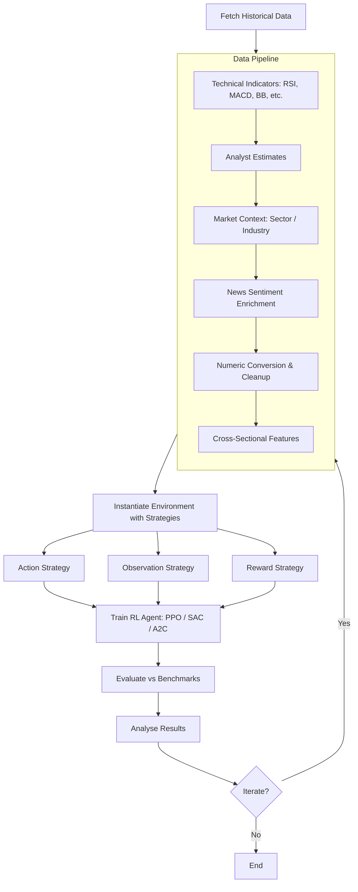

# QuantRL-Lab

[](https://badge.fury.io/py/quantrl-lab)
[](https://pypi.org/project/quantrl-lab/)
[](https://opensource.org/licenses/MIT)
[](https://whanyu1212.github.io/QuantRL-Lab/)
[](https://github.com/whanyu1212/QuantRL-Lab)

A Python testbed for Reinforcement Learning in finance. Emphasizes modularity via dependency injection of pluggable action, observation, and reward strategies — enabling rapid experimentation without rewriting environment code. For full API reference, guides, and examples see the [**documentation**](https://whanyu1212.github.io/QuantRL-Lab/).

---

## Table of Contents

- [Installation](#installation)
- [Motivation](#motivation)
- [Quick Start](#quick-start)
- [Roadmap](#roadmap)
- [Contributing](#contributing)
- [Contributors](#contributors)
- [Literature Review](#literature-review)

---

## Installation

```bash
pip install quantrl-lab
# or (recommended)
uv pip install quantrl-lab
```

Optional extras:

```bash
pip install quantrl-lab[notebooks]   # Jupyter support
pip install quantrl-lab[ml]          # torch, transformers, litellm
pip install quantrl-lab[dev]         # pytest, black, mypy, etc.
pip install quantrl-lab[full]        # everything
```

**Contributors**: see [CONTRIBUTING.md](CONTRIBUTING.md) for the uv-based development setup.

---

## Motivation

Most RL frameworks for finance hardcode action spaces, observation spaces, and reward functions into the environment. This makes experimentation slow — changing a reward function can require significant refactoring.

**QuantRL-Lab** solves this with a strategy injection pattern: pass three pluggable objects at environment instantiation time and swap them freely without touching environment internals.

---

## Quick Start

### System Workflow



### Example

```python
from stable_baselines3 import PPO, SAC
from quantrl_lab.environments.stock.strategies.actions.standard import StandardActionStrategy
from quantrl_lab.environments.stock.strategies.observations.feature_aware import FeatureAwareObservationStrategy
from quantrl_lab.environments.stock.strategies.rewards.portfolio_value import PortfolioValueChangeReward
from quantrl_lab.experiments.backtesting.builder import BacktestEnvironmentBuilder
from quantrl_lab.experiments.backtesting.core import ExperimentJob, JobGenerator
from quantrl_lab.experiments.backtesting.runner import BacktestRunner

# Instantiate pluggable strategies
action_strategy = StandardActionStrategy()
reward_strategy = PortfolioValueChangeReward()
observation_strategy = FeatureAwareObservationStrategy()

# Build environment config (train_df / test_df are pre-processed DataFrames)
env_config = (
    BacktestEnvironmentBuilder()
    .with_data(train_data=train_df, test_data=test_df)
    .with_strategies(
        action=action_strategy,
        reward=reward_strategy,
        observation=observation_strategy,
    )
    .with_env_params(initial_balance=100_000, window_size=20)
    .build()
)

runner = BacktestRunner(verbose=True)

# Single run
job = ExperimentJob(algorithm_class=PPO, env_config=env_config, total_timesteps=50_000)
result = runner.run_job(job)
BacktestRunner.inspect_result(result)

# Grid sweep across algorithms
jobs = JobGenerator.generate_grid(
    algorithms=[PPO, SAC],
    env_configs={'base': env_config},
    total_timesteps=50_000,
)
results = runner.run_batch(jobs)
BacktestRunner.inspect_batch(results)
```

---

## Roadmap

- **Data sources**: crypto and OANDA forex support
- **Technical indicators**: Ichimoku, Williams %R, CCI additions
- **Environments**: multi-stock environment with hedging pair capabilities (in progress)
- **Observable space**: fundamental data, macroeconomic indicators, sector performance

---

## Contributing

1. Fork the repository and create a feature branch
2. Make changes following the coding standards in [CONTRIBUTING.md](CONTRIBUTING.md)
3. Write tests for new functionality (`uv run pytest -m "not integration"`)
4. Run `pre-commit run --all-files` before submitting
5. Open a pull request with a clear description

### AI-Assisted Development

If you use AI coding tools, [CLAUDE.md](CLAUDE.md) and [AGENTS.md](AGENTS.md) contain project context that helps models understand the codebase architecture and conventions. That said, the general rule of thumb is: **take ownership of what you submit**. Understand the code, test it, and don't ship AI slop.

---

## Contributors

<table>
  <tr>
    <td align="center">
      <a href="https://github.com/whanyu1212">
        
        <br />
        <sub><b>whanyu1212</b></sub>
      </a>
      <br />
      <sub>Creator & Maintainer</sub>
    </td>
  </tr>
</table>

---

## Literature Review

<!-- Content to be added -->
