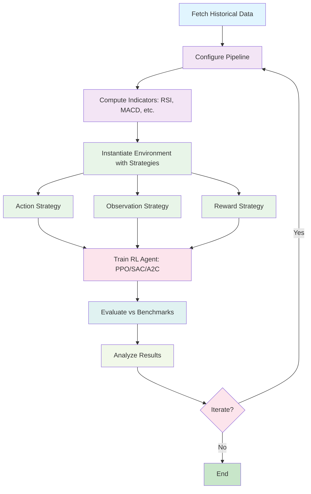
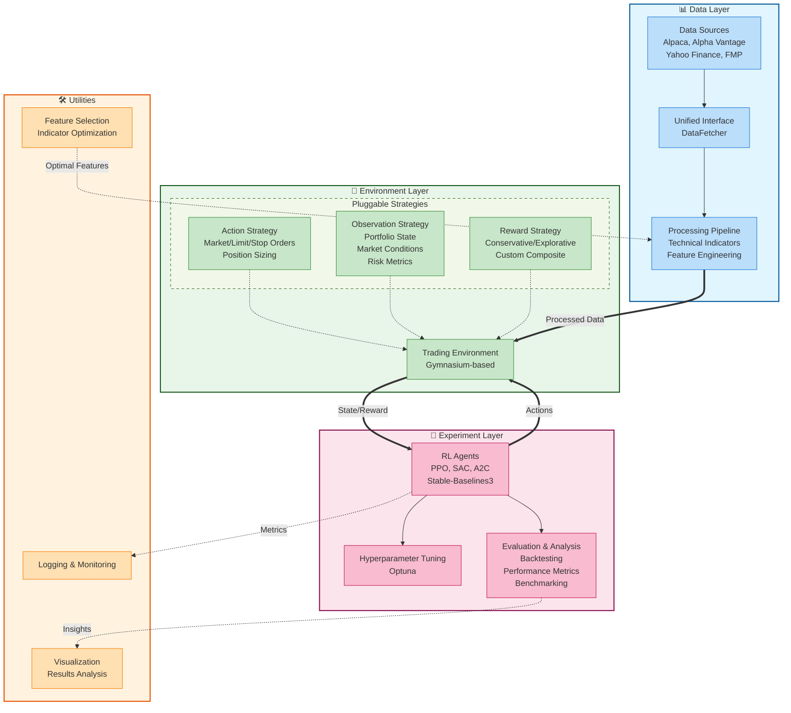
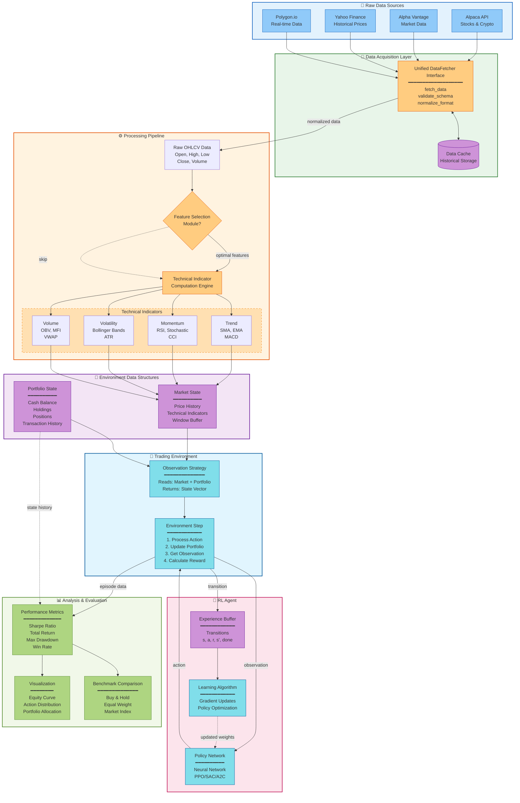
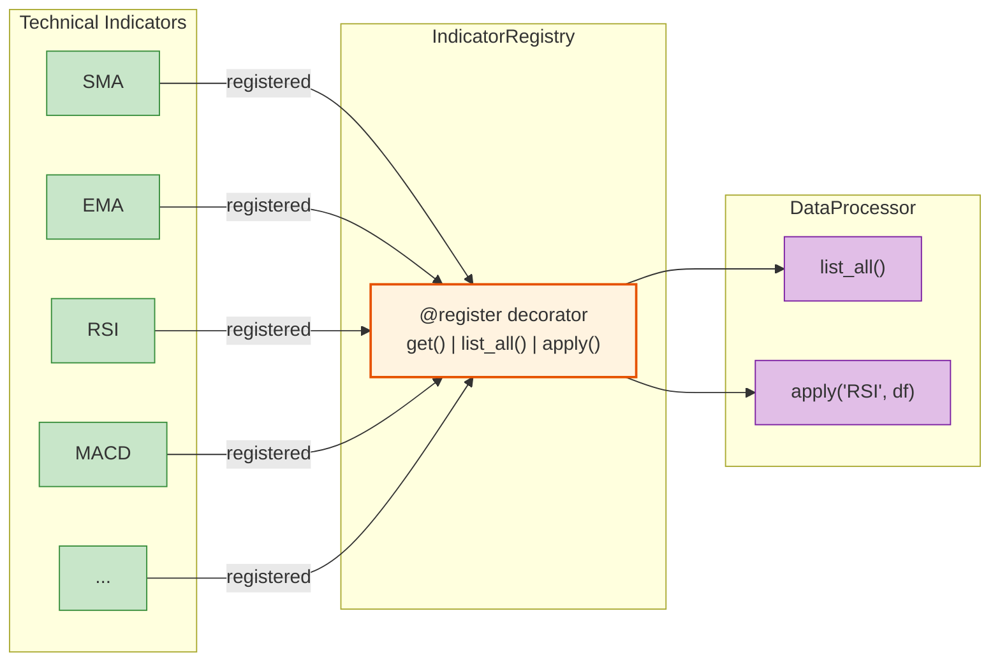
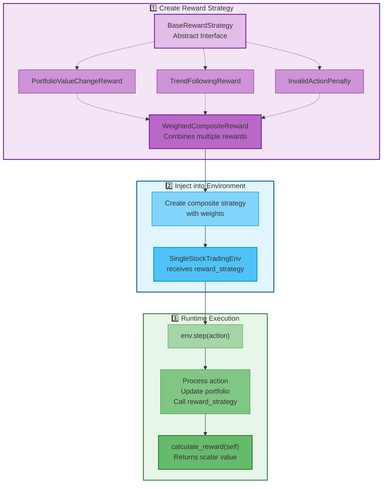

# QuantRL-Lab Architecture Guide

This document provides detailed architectural documentation for QuantRL-Lab, covering design patterns, data flows, and system components. For a quick overview, see the [main README](https://github.com/whanyu1212/QuantRL-Lab#readme).

## Table of Contents
- [Workflow Overview](#workflow-overview)
- [High-Level Architecture](#high-level-architecture)
- [Strategy Pattern Implementation](#strategy-pattern-implementation)
- [Data Flow Pipeline](#data-flow-pipeline)
- [Pre-built Components](#pre-built-components)
- [Extensibility & Customization](#extensibility-customization)
- [Protocol Pattern in Action](#protocol-pattern-in-action)
- [Registry Pattern for Technical Indicators](#registry-pattern-for-technical-indicators)
- [Reward Strategy Pattern](#reward-strategy-pattern)

---

## Workflow Overview

End-to-end process from data acquisition to model evaluation:



This iterative workflow demonstrates the core experimental loop in QuantRL-Lab: fetch data, configure the pipeline with indicators, instantiate the environment with pluggable strategies, train the agent, evaluate performance, and iterate based on results.

---

## High-Level Architecture

The system is organized into four main layers: Data, Environment, Experiment, and Utilities.



**Key architectural principles:**
- **Separation of concerns**: Data acquisition, environment logic, and experimentation are independent
- **Dependency injection**: Strategies are injected into environments, not hardcoded
- **Protocol-based interfaces**: Data sources implement capability protocols for flexible integration
- **Registry pattern**: Technical indicators are auto-registered for dynamic discovery

---

## Strategy Pattern Implementation

How pluggable strategies interact with the trading environment through dependency injection:

```mermaid
graph TB
    subgraph Client["👤 Client Code"]
        CONFIG[Environment Configuration]
    end

    subgraph Core["🎯 Core Trading Environment"]
        ENV[TradingEnv<br/>Gymnasium Interface]

        subgraph State["Internal State"]
            PORTFOLIO[Portfolio Manager<br/>Balance, Holdings, Positions]
            MARKET[Market Data<br/>Price History, Indicators]
        end
    end

    subgraph Strategies["🔌 Pluggable Strategy Components"]
        direction TB

        AS[ActionStrategy<br/>━━━━━━━━━━━━<br/>process_action]
        OS[ObservationStrategy<br/>━━━━━━━━━━━━<br/>get_observation]
        RS[RewardStrategy<br/>━━━━━━━━━━━━<br/>calculate_reward]

        subgraph ASImpl["Action Implementations"]
            AS1[DiscreteActionStrategy<br/>Buy/Hold/Sell]
            AS2[ContinuousActionStrategy<br/>Position Sizing]
            AS3[MultiOrderStrategy<br/>Market/Limit/Stop]
        end

        subgraph OSImpl["Observation Implementations"]
            OS1[SimpleObservation<br/>Price + Balance]
            OS2[RichObservation<br/>Portfolio + Risk Metrics]
            OS3[CustomObservation<br/>User-defined Features]
        end

        subgraph RSImpl["Reward Implementations"]
            RS1[ConservativeReward<br/>Sharpe-based]
            RS2[ExplorativeReward<br/>Return-based]
            RS3[CompositeReward<br/>Multi-objective]
        end
    end

    subgraph Agent["🤖 RL Agent"]
        ALGO[Algorithm<br/>PPO/SAC/A2C]
    end

    CONFIG -->|1. Inject Strategies| ENV
    CONFIG -.->|Configure| AS
    CONFIG -.->|Configure| OS
    CONFIG -.->|Configure| RS

    AS1 -.->|implements| AS
    AS2 -.->|implements| AS
    AS3 -.->|implements| AS

    OS1 -.->|implements| OS
    OS2 -.->|implements| OS
    OS3 -.->|implements| OS

    RS1 -.->|implements| RS
    RS2 -.->|implements| RS
    RS3 -.->|implements| RS

    ALGO -->|2. action| ENV
    ENV -->|3. delegates to| AS
    AS -->|4. validated action| PORTFOLIO

    PORTFOLIO -.->|5. state change| ENV
    ENV -->|6. delegates to| OS
    OS -->|7. reads| PORTFOLIO
    OS -->|8. reads| MARKET
    OS -->|9. observation| ENV

    ENV -->|10. delegates to| RS
    RS -->|11. reads| PORTFOLIO
    RS -->|12. reward| ENV

    ENV -->|13. obs, reward, done, info| ALGO

    style ENV fill:#4caf50,stroke:#2e7d32,stroke-width:3px,color:#fff
    style AS fill:#2196f3,stroke:#1565c0,stroke-width:2px,color:#fff
    style OS fill:#ff9800,stroke:#e65100,stroke-width:2px,color:#fff
    style RS fill:#9c27b0,stroke:#6a1b9a,stroke-width:2px,color:#fff

    style PORTFOLIO fill:#c8e6c9,stroke:#388e3c
    style MARKET fill:#c8e6c9,stroke:#388e3c
    style CONFIG fill:#e1f5fe,stroke:#01579b
    style ALGO fill:#fce4ec,stroke:#c2185b

    style ASImpl fill:#bbdefb,stroke:#1976d2,stroke-dasharray: 5 5
    style OSImpl fill:#ffe0b2,stroke:#f57c00,stroke-dasharray: 5 5
    style RSImpl fill:#e1bee7,stroke:#7b1fa2,stroke-dasharray: 5 5

    classDef strategyInterface fill:#1976d2,stroke:#0d47a1,color:#fff
    classDef implementation fill:#fff,stroke:#666,stroke-dasharray: 3 3

    class AS,OS,RS strategyInterface
    class AS1,AS2,AS3,OS1,OS2,OS3,RS1,RS2,RS3 implementation
```



**Step-by-step execution flow:**
1. Client code creates strategy instances and injects them into the environment
2. RL agent sends action to environment
3. Environment delegates action processing to ActionStrategy
4. ActionStrategy validates and executes trades, updating Portfolio
5. Portfolio state changes trigger observation update
6. Environment delegates to ObservationStrategy to build state vector
7. ObservationStrategy reads from Portfolio and Market data
8. Environment receives observation
9. Environment delegates to RewardStrategy to calculate reward
10. RewardStrategy computes reward based on Portfolio metrics
11. Environment returns full transition tuple to agent

This pattern allows you to experiment with different reward functions, observation spaces, and action strategies without modifying the core environment code.

---

## Data Flow Pipeline

How data moves from raw sources through processing to the RL agent. This diagram shows the complete data transformation pipeline from heterogeneous market data sources to actionable insights for the RL agent.

See the complete data flow diagram in the sections below.



**Data transformation stages:**
1. **Raw Sources**: Multiple heterogeneous APIs providing market data (Alpaca, Alpha Vantage, Yahoo Finance, FMP)
2. **Acquisition Layer**: Unified interface normalizes different formats, validates schemas, caches historical data
3. **Processing Pipeline**: Optional feature selection module, followed by technical indicator computation (trend, momentum, volatility, volume indicators)
4. **Environment Data**: Structured state maintained by environment (market history with indicators + portfolio state with holdings/positions)
5. **RL Agent**: Policy network processes observations, experience buffer stores transitions (s, a, r, s', done), learning algorithm updates weights
6. **Evaluation**: Performance metrics computed (Sharpe, returns, drawdown, win rate), visualizations generated (equity curves, action distributions), benchmarks compared (buy & hold, equal weight, index)

---

## Pre-built Components

Out-of-the-box strategies and configurations available in the framework. These components are production-ready and can be used immediately or extended for custom behavior.

```mermaid
graph TB
    subgraph AS["🎯 Action Strategies"]
        AS1[StandardMarketActionStrategy<br/>━━━━━━━━━━━━━━━━━<br/>• 3D Continuous Action Space<br/>• Market Orders<br/>• Limit Orders<br/>• Stop-Loss & Take-Profit<br/>• Dynamic Position Sizing]

        AS2[Custom Action Strategies<br/>━━━━━━━━━━━━━━━━━<br/>Extend BaseActionStrategy<br/>to create your own]
    end

    subgraph OS["👁️ Observation Strategies"]
        OS1[PortfolioWithTrendObservation<br/>━━━━━━━━━━━━━━━━━━━━━━<br/>9-Feature Observation Space]

        subgraph OSF["Feature Breakdown"]
            F1[1. Balance Ratio<br/>Cash / Initial Balance]
            F2[2. Position Size Ratio<br/>Holdings Value / Portfolio]
            F3[3. Unrealized P/L %<br/>Position Gain/Loss]
            F4[4. Risk/Reward Ratio<br/>Potential Loss vs Gain]
            F5[5-6. Stop/Target Distance<br/>Price Distance to Limits]
            F6[7. Trend Strength<br/>Market Direction Signal]
            F7[8. Volatility<br/>Price Fluctuation Metric]
            F8[9. High/Low Context<br/>Recent Price Range]
        end

        OS1 --> OSF

        OS2[Custom Observation<br/>━━━━━━━━━━━━━<br/>Extend BaseObservationStrategy]
    end

    subgraph RS["🎁 Reward Strategies"]
        direction TB

        RS0[Individual Reward Components<br/>━━━━━━━━━━━━━━━━━━━━]

        RS1[1. PortfolioValueChangeReward<br/>Returns-based reward]
        RS2[2. InvalidActionPenalty<br/>Penalizes illegal actions]
        RS3[3. TrendFollowingReward<br/>Rewards trend alignment]
        RS4[4. HoldPenalty<br/>Discourages inaction]
        RS5[5. PositionSizingRiskReward<br/>Optimal position management]
        RS6[6. CashFlowRiskManagement<br/>Cash utilization optimization]
        RS7[7. ExcessiveCashUsagePenalty<br/>Prevents over-leveraging]

        RS0 --> RS1
        RS0 --> RS2
        RS0 --> RS3
        RS0 --> RS4
        RS0 --> RS5
        RS0 --> RS6
        RS0 --> RS7

        COMP[WeightedCompositeReward<br/>━━━━━━━━━━━━━━━━━<br/>Combines multiple rewards<br/>with custom weights]

        RS1 -.-> COMP
        RS2 -.-> COMP
        RS3 -.-> COMP
        RS4 -.-> COMP
        RS5 -.-> COMP
        RS6 -.-> COMP
        RS7 -.-> COMP

        subgraph PRESETS["Preset Combinations"]
            P1[Conservative<br/>High penalty weighting]
            P2[Balanced<br/>Equal distribution]
            P3[Aggressive<br/>High trend following]
            P4[Risk Managed<br/>Focus on risk metrics]
        end

        COMP --> PRESETS
    end

    style AS fill:#e3f2fd,stroke:#1565c0,stroke-width:2px
    style OS fill:#fff3e0,stroke:#e65100,stroke-width:2px
    style RS fill:#f3e5f5,stroke:#6a1b9a,stroke-width:2px
    style OSF fill:#ffe0b2,stroke:#f57c00,stroke-dasharray: 3 3
    style PRESETS fill:#e1bee7,stroke:#7b1fa2,stroke-dasharray: 3 3

    style AS1 fill:#bbdefb,stroke:#1976d2
    style OS1 fill:#ffcc80,stroke:#e65100
    style COMP fill:#ce93d8,stroke:#6a1b9a

    style AS2 fill:#fff,stroke:#666,stroke-dasharray: 5 5
    style OS2 fill:#fff,stroke:#666,stroke-dasharray: 5 5

    classDef feature fill:#fff9c4,stroke:#f57f17
    classDef preset fill:#f8bbd0,stroke:#c2185b

    class F1,F2,F3,F4,F5,F6,F7,F8 feature
    class P1,P2,P3,P4 preset
```



**Using pre-built components:**
```python
from quantrl_lab.environments.stock.strategies.actions import StandardMarketActionStrategy
from quantrl_lab.environments.stock.strategies.observations import PortfolioWithTrendObservation
from quantrl_lab.environments.stock.strategies.rewards import WeightedCompositeReward
from quantrl_lab.experiments.backtesting.config import get_reward_preset

# Use pre-built strategies
action_strategy = StandardMarketActionStrategy()
observation_strategy = PortfolioWithTrendObservation()
reward_strategy = get_reward_preset("conservative")

# Or create custom composite
from quantrl_lab.environments.stock.strategies.rewards import (
    PortfolioValueChangeReward,
    TrendFollowingReward,
    InvalidActionPenalty
)

custom_reward = WeightedCompositeReward(
    components=[
        PortfolioValueChangeReward(),
        TrendFollowingReward(),
        InvalidActionPenalty(),
    ],
    weights=[0.5, 0.3, 0.2]
)
```

---

## Extensibility & Customization

Class hierarchy showing how to extend the framework with custom strategies. The framework uses abstract base classes with clearly defined interfaces, making it straightforward to implement custom behavior.

```mermaid
classDiagram
    class BaseActionStrategy {
        <<abstract>>
        +define_action_space()*
        +process_action(action)*
        +get_action_space_info()*
    }

    class BaseObservationStrategy {
        <<abstract>>
        +define_observation_space()*
        +build_observation()*
    }

    class BaseRewardStrategy {
        <<abstract>>
        +calculate_reward()*
        +reset()
    }

    class TradingEnv {
        +action_strategy
        +observation_strategy
        +reward_strategy
        +step()
        +reset()
    }

    %% Pre-built Implementations
    class StandardMarketActionStrategy {
        +3D continuous action space
        +Market/Limit/Stop orders
        +Position sizing
    }

    class PortfolioWithTrendObservation {
        +9-feature observation
        +Trend & volatility metrics
        +Risk/reward calculations
    }

    class WeightedCompositeReward {
        +Combines multiple rewards
        +Configurable weights
    }

    %% Custom User Implementations
    class CustomActionStrategy {
        +Your custom logic
        +define_action_space()
        +process_action()
    }

    class CustomObservationStrategy {
        +Your custom features
        +define_observation_space()
        +build_observation()
    }

    class CustomRewardStrategy {
        +Your custom objectives
        +calculate_reward()
    }

    %% Inheritance relationships
    BaseActionStrategy <|-- StandardMarketActionStrategy : implements
    BaseActionStrategy <|-- CustomActionStrategy : extend

    BaseObservationStrategy <|-- PortfolioWithTrendObservation : implements
    BaseObservationStrategy <|-- CustomObservationStrategy : extend

    BaseRewardStrategy <|-- WeightedCompositeReward : implements
    BaseRewardStrategy <|-- CustomRewardStrategy : extend

    %% Composition relationships
    TradingEnv o-- BaseActionStrategy : uses
    TradingEnv o-- BaseObservationStrategy : uses
    TradingEnv o-- BaseRewardStrategy : uses

    %% Notes
    note for TradingEnv "Strategies are injected\nvia dependency injection.\n\nMix and match:\n• Pre-built components\n• Custom implementations\n• Hybrid approaches"

    note for CustomActionStrategy "Extend base classes\nto create your own:\n\n1. Inherit from base\n2. Implement abstract methods\n3. Add custom logic\n4. Inject into environment"

    %% Styling
    style BaseActionStrategy fill:#2196f3,stroke:#1565c0,color:#fff
    style BaseObservationStrategy fill:#ff9800,stroke:#e65100,color:#fff
    style BaseRewardStrategy fill:#9c27b0,stroke:#6a1b9a,color:#fff

    style StandardMarketActionStrategy fill:#bbdefb,stroke:#1976d2
    style PortfolioWithTrendObservation fill:#ffe0b2,stroke:#f57c00
    style WeightedCompositeReward fill:#e1bee7,stroke:#7b1fa2

    style CustomActionStrategy fill:#c8e6c9,stroke:#388e3c
    style CustomObservationStrategy fill:#c8e6c9,stroke:#388e3c
    style CustomRewardStrategy fill:#c8e6c9,stroke:#388e3c

    style TradingEnv fill:#4caf50,stroke:#2e7d32,color:#fff
```



**Example: Creating a custom reward strategy**
```python
from quantrl_lab.environments.strategies.rewards import BaseRewardStrategy
import numpy as np

class CustomSharpeReward(BaseRewardStrategy):
    """Custom reward based on rolling Sharpe ratio."""

    def __init__(self, window: int = 20):
        super().__init__()
        self.window = window
        self.returns_history = []

    def calculate_reward(self) -> float:
        """Calculate reward based on Sharpe ratio."""
        # Access environment state via self.env
        portfolio_value = self.env.portfolio.get_portfolio_value()

        # Calculate return
        if len(self.returns_history) == 0:
            current_return = 0.0
        else:
            prev_value = self.returns_history[-1]
            current_return = (portfolio_value - prev_value) / prev_value

        self.returns_history.append(portfolio_value)

        # Calculate rolling Sharpe
        if len(self.returns_history) < self.window:
            return current_return

        recent_returns = self.returns_history[-self.window:]
        mean_return = np.mean(recent_returns)
        std_return = np.std(recent_returns)

        if std_return == 0:
            return 0.0

        sharpe = mean_return / std_return
        return sharpe

    def reset(self):
        """Reset state between episodes."""
        self.returns_history = []

# Use it in your environment
from quantrl_lab.environments.stock import SingleStockTradingEnv

env = SingleStockTradingEnv(
    data=df,
    config=config,
    action_strategy=action_strategy,
    observation_strategy=observation_strategy,
    reward_strategy=CustomSharpeReward(window=20)  # ← Custom reward
)
```

---

## Design Decision: Protocols vs Abstract Base Classes (ABC)

### Why We Chose Protocols Over ABC

QuantRL-Lab uses Python's **Protocol** pattern (PEP 544 - Structural Subtyping) instead of traditional Abstract Base Classes (ABC) for defining data source capabilities. This is a deliberate architectural decision with significant benefits for extensibility and maintainability.

### The Problem with ABC-Only Design

If we used only ABC (Abstract Base Classes), we'd face several challenges:

**1. Single Inheritance Limitation**
```python
# ❌ ABC-only approach - forces rigid inheritance hierarchy
from abc import ABC, abstractmethod

class HistoricalDataSource(ABC):
    @abstractmethod
    def get_historical_ohlcv_data(self, ...): pass

class LiveDataSource(ABC):
    @abstractmethod
    def get_latest_quote(self, ...): pass

# Problem: How do we create a class that supports BOTH?
class AlpacaDataLoader(HistoricalDataSource, LiveDataSource):  # Multiple inheritance issues!
    # Diamond problem, method resolution order conflicts, etc.
    pass
```

**2. Forced Inheritance Chain**
```python
# ❌ ABC-only: Forces all data sources to inherit from base class
class AlpacaDataLoader(DataSource, HistoricalDataSource, LiveDataSource, NewsDataSource):
    # Messy inheritance chain
    # Tightly coupled to base classes
    # Hard to add new capabilities later
    pass
```

**3. Inflexibility for External Integrations**
```python
# ❌ ABC-only: Cannot adapt third-party libraries without inheritance
from some_library import ThirdPartyDataFeed

# This won't work - ThirdPartyDataFeed doesn't inherit from our ABC
class AdaptedDataSource(ThirdPartyDataFeed, HistoricalDataSource):
    # Requires modifying third-party code or complex adapter patterns
    pass
```

### The Protocol Solution

Protocols solve these problems through **structural subtyping** (duck typing with type safety):

**1. Multiple Capabilities Without Multiple Inheritance**
```python
# ✅ Protocol approach - compose capabilities freely
from typing import Protocol, runtime_checkable

@runtime_checkable
class HistoricalDataCapable(Protocol):
    def get_historical_ohlcv_data(self, ...): ...

@runtime_checkable
class LiveDataCapable(Protocol):
    def get_latest_quote(self, ...): ...

# Any class with these methods automatically satisfies both protocols!
class AlpacaDataLoader(DataSource):  # Clean single inheritance
    def get_historical_ohlcv_data(self, ...): ...  # Satisfies HistoricalDataCapable
    def get_latest_quote(self, ...): ...  # Satisfies LiveDataCapable
    # No explicit inheritance of protocols needed!

# Runtime checking works:
if isinstance(loader, HistoricalDataCapable):  # ✅ True
    data = loader.get_historical_ohlcv_data(...)

if isinstance(loader, LiveDataCapable):  # ✅ True
    quote = loader.get_latest_quote(...)
```

**2. Flexible Capability Composition**
```python
# ✅ Different data sources implement different combinations
class YFinanceDataLoader(DataSource):
    # Implements: HistoricalDataCapable, FundamentalDataCapable
    # Does NOT implement: LiveDataCapable, StreamingCapable
    # No complex inheritance - just has the methods!
    pass

class AlpacaDataLoader(DataSource):
    # Implements: HistoricalDataCapable, LiveDataCapable, StreamingCapable, NewsDataCapable
    # Simply has all the methods - no inheritance complexity
    pass
```

**3. Easy External Integration**
```python
# ✅ Protocol approach - adapt any class without modifying it
from some_library import ThirdPartyDataFeed

# If ThirdPartyDataFeed has get_historical_ohlcv_data(), it automatically satisfies the protocol!
feed = ThirdPartyDataFeed()

if isinstance(feed, HistoricalDataCapable):  # Checks structural compatibility
    # It works! No inheritance or adapters needed
    data = feed.get_historical_ohlcv_data(...)
```

### Hybrid Approach: DataSource ABC + Capability Protocols

QuantRL-Lab uses a **hybrid approach** combining the best of both:

```python
# Base ABC for common functionality
class DataSource(ABC):
    """Base class providing common infrastructure."""

    @property
    @abstractmethod
    def source_name(self) -> str:
        """Every data source must have a name."""
        pass

    def connect(self) -> None:
        """Default implementation (can be overridden)."""
        pass

    @property
    def supported_features(self) -> List[str]:
        """Auto-detects which protocols are implemented."""
        features = []
        if isinstance(self, HistoricalDataCapable):
            features.append("historical_bars")
        if isinstance(self, LiveDataCapable):
            features.append("live_data")
        # ... etc
        return features

# Capability protocols for flexible features
@runtime_checkable
class HistoricalDataCapable(Protocol):
    """Defines WHAT a historical data source can do."""
    def get_historical_ohlcv_data(self, ...): ...

@runtime_checkable
class AnalystDataCapable(Protocol):
    """Defines WHAT an analyst data source can do."""
    def get_historical_grades(self, ...): ...
    def get_historical_rating(self, ...): ...

# Concrete implementation
class FMPDataSource(
    DataSource,  # Inherits common infrastructure
    HistoricalDataCapable,  # Declares capability (structural typing)
    AnalystDataCapable,  # Declares another capability
):
    """
    Inherits base infrastructure from DataSource ABC.
    Implements multiple capability protocols through structural typing.
    """
    def get_historical_ohlcv_data(self, ...):
        # Implementation satisfies HistoricalDataCapable protocol
        pass

    def get_historical_grades(self, ...):
        # Implementation satisfies AnalystDataCapable protocol
        pass
```

### Key Benefits in QuantRL-Lab

| Aspect | ABC-Only | Protocol-Based | Our Hybrid Approach |
|--------|----------|---------------|---------------------|
| **Multiple Capabilities** | Complex multiple inheritance | ✅ Compose freely | ✅ Best of both |
| **Extensibility** | Modify base classes | ✅ Add protocols independently | ✅ Add protocols independently |
| **Type Safety** | ✅ Static checking | ✅ Static + runtime checking | ✅ Static + runtime checking |
| **Third-Party Integration** | Requires adapters | ✅ Structural compatibility | ✅ Structural compatibility |
| **Feature Discovery** | Manual implementation | ✅ Runtime `isinstance()` checks | ✅ Auto via `supported_features` |
| **Common Infrastructure** | ✅ Shared via ABC | Need composition | ✅ Shared via DataSource ABC |
| **Inheritance Complexity** | ❌ Diamond problem risk | ✅ No inheritance needed | ✅ Single inheritance only |

### Real-World Example: Adding New Capabilities

**Scenario:** FMP adds sector/industry performance data

**ABC-Only Approach (Complex):**
```python
# ❌ Would need to modify class hierarchy
class SectorDataSource(ABC):
    @abstractmethod
    def get_historical_sector_performance(self, ...): pass

class FMPDataSource(DataSource, HistoricalDataSource, AnalystDataSource, SectorDataSource):
    # Messy multiple inheritance chain
    pass
```

**Protocol Approach (Simple):**
```python
# ✅ Just define a new protocol
@runtime_checkable
class SectorDataCapable(Protocol):
    def get_historical_sector_performance(self, ...): ...
    def get_historical_industry_performance(self, ...): ...

# Add methods to FMP - it automatically satisfies the protocol!
class FMPDataSource(DataSource):
    def get_historical_sector_performance(self, sector):
        # Implementation
        pass

    def get_historical_industry_performance(self, industry):
        # Implementation
        pass

# No inheritance changes needed - works immediately!
if isinstance(fmp_loader, SectorDataCapable):  # ✅ True
    sector_data = fmp_loader.get_historical_sector_performance("Technology")
```

### When to Use Each Pattern

**Use ABC (Abstract Base Class) when:**
- ✅ Defining common infrastructure/utilities shared by all implementations
- ✅ Enforcing a base contract that ALL implementations must follow
- ✅ Providing default implementations of common methods

**Use Protocol when:**
- ✅ Defining optional capabilities that only some implementations provide
- ✅ Enabling multiple capability combinations
- ✅ Supporting structural subtyping for external integration
- ✅ Runtime feature detection/discovery

**Our Hybrid Approach:**
- `DataSource` ABC: Common infrastructure (source_name, connect/disconnect, supported_features)
- Capability Protocols: Optional features (HistoricalDataCapable, LiveDataCapable, AnalystDataCapable, SectorDataCapable, etc.)

### Further Reading

- [PEP 544 - Protocols: Structural subtyping](https://peps.python.org/pep-0544/)
- [Python typing documentation - Protocol](https://docs.python.org/3/library/typing.html#typing.Protocol)
- [Effective Python Item 43: Consider Protocols and Duck Typing](https://effectivepython.com/)

---

## Protocol Pattern in Action

Structural typing for flexible, decoupled design across data sources and environments. Protocols define "what" an object can do without forcing "how" it inherits.

```mermaid
graph TB
    subgraph Concept["💡 Protocol Concept"]
        direction TB
        PROTO_DEF["Protocol defines interface<br/>━━━━━━━━━━━━━━━━<br/>• No inheritance required<br/>• Duck typing with type checking<br/>• Structural subtyping"]

        PROTO_ADV["Advantages<br/>━━━━━━━━━━<br/>✓ Loose coupling<br/>✓ Multiple capabilities<br/>✓ Runtime checkable<br/>✓ No diamond problem"]
    end

    subgraph DataProtocols["📡 Data Source Protocols"]
        direction TB

        BASE[DataSource<br/>━━━━━━━━━━<br/>Abstract Base Class<br/>Common interface]

        P1[HistoricalDataCapable<br/>━━━━━━━━━━━━━━━━<br/>get_historical_ohlcv_data]
        P2[LiveDataCapable<br/>━━━━━━━━━━━━━━<br/>get_latest_quote<br/>get_latest_trade]
        P3[NewsDataCapable<br/>━━━━━━━━━━━━━<br/>get_news_data]
        P4[StreamingCapable<br/>━━━━━━━━━━━━━<br/>subscribe_to_updates<br/>start_streaming<br/>stop_streaming]
        P5[ConnectionManaged<br/>━━━━━━━━━━━━━━<br/>connect, disconnect, is_connected]
        P6[FundamentalDataCapable<br/>━━━━━━━━━━━━━━━━━<br/>get_fundamental_data]
        P7[MacroDataCapable<br/>━━━━━━━━━━━━━<br/>get_macro_data]
        P8[AnalystDataCapable<br/>━━━━━━━━━━━━━━<br/>get_historical_grades<br/>get_historical_rating]
        P9[SectorDataCapable<br/>━━━━━━━━━━━━━<br/>get_historical_sector_performance<br/>get_historical_industry_performance]
        P10[CompanyProfileCapable<br/>━━━━━━━━━━━━━━━━<br/>get_company_profile]
    end

    subgraph EnvProtocol["🏪 Environment Protocol"]
        direction TB

        EP[TradingEnvProtocol<br/>━━━━━━━━━━━━━━━<br/>Defines required attributes<br/>& methods for trading envs]

        EP_ATTRS["Required Attributes:<br/>• data: np.ndarray<br/>• current_step: int<br/>• window_size: int<br/>• action_space<br/>• observation_space"]

        EP_METHODS["Required Methods:<br/>• step<br/>• reset<br/>• render<br/>• close"]

        EP --> EP_ATTRS
        EP --> EP_METHODS
    end

    subgraph Implementations["🔧 Concrete Implementations"]
        direction TB

        YF[YFinanceDataLoader<br/>━━━━━━━━━━━━━━<br/>Inherits: DataSource<br/>Implements: HistoricalDataCapable<br/>           FundamentalDataCapable]

        ALP[AlpacaDataLoader<br/>━━━━━━━━━━━━━<br/>Inherits: DataSource<br/>Implements: HistoricalDataCapable<br/>           LiveDataCapable<br/>           StreamingCapable<br/>           NewsDataCapable<br/>           ConnectionManaged]

        AVDL[AlphaVantageDataLoader<br/>━━━━━━━━━━━━━━━━━<br/>Inherits: DataSource<br/>Implements: HistoricalDataCapable<br/>           FundamentalDataCapable<br/>           MacroDataCapable<br/>           NewsDataCapable]

        FMP[FMPDataSource<br/>━━━━━━━━━━━<br/>Inherits: DataSource<br/>Implements: HistoricalDataCapable<br/>           AnalystDataCapable<br/>           SectorDataCapable<br/>           CompanyProfileCapable]

        TE[TradingEnv<br/>━━━━━━━━━<br/>Implements: TradingEnvProtocol<br/>Has all required attributes<br/>& methods]
    end

    subgraph Usage["💼 Usage Pattern"]
        direction TB

        CHECK["Runtime Check<br/>━━━━━━━━━━━━<br/>isinstance(obj, Protocol)<br/>Checks structural compatibility"]

        FEATURE["Feature Detection<br/>━━━━━━━━━━━━━━<br/>if isinstance(source, LiveDataCapable):<br/>    # Use live data features<br/>else:<br/>    # Fall back to historical"]

        COMPOSE["Compose Capabilities<br/>━━━━━━━━━━━━━━━━<br/>Class can implement<br/>multiple protocols<br/>to gain multiple capabilities"]
    end

    subgraph Benefits["✨ Benefits in QuantRL-Lab"]
        direction TB

        B1["Flexibility<br/>━━━━━━━━━<br/>Data sources can<br/>implement any combination<br/>of capabilities"]

        B2["Type Safety<br/>━━━━━━━━━<br/>Static type checkers<br/>validate protocol<br/>compliance"]

        B3["Decoupling<br/>━━━━━━━━━<br/>Code depends on<br/>protocols, not<br/>concrete classes"]

        B4["Discoverability<br/>━━━━━━━━━━━<br/>supported_features()<br/>checks which protocols<br/>are implemented"]
    end

    PROTO_DEF -.-> P1
    PROTO_DEF -.-> P2
    PROTO_DEF -.-> EP

    BASE --> YF
    BASE --> ALP
    BASE --> AVDL
    BASE --> FMP

    P1 -.->|structural typing| YF
    P6 -.->|structural typing| YF

    P1 -.->|structural typing| ALP
    P2 -.->|structural typing| ALP
    P3 -.->|structural typing| ALP
    P4 -.->|structural typing| ALP
    P5 -.->|structural typing| ALP

    P1 -.->|structural typing| AVDL
    P6 -.->|structural typing| AVDL
    P7 -.->|structural typing| AVDL
    P3 -.->|structural typing| AVDL

    P1 -.->|structural typing| FMP
    P8 -.->|structural typing| FMP
    P9 -.->|structural typing| FMP
    P10 -.->|structural typing| FMP

    EP -.->|structural typing| TE

    YF --> CHECK
    ALP --> CHECK
    AVDL --> CHECK
    FMP --> CHECK
    CHECK --> FEATURE
    FEATURE --> COMPOSE

    COMPOSE --> B1
    COMPOSE --> B2
    COMPOSE --> B3
    COMPOSE --> B4

    style PROTO_DEF fill:#e1f5fe,stroke:#01579b,stroke-width:2px
    style PROTO_ADV fill:#b3e5fc,stroke:#0277bd

    style BASE fill:#fff3e0,stroke:#e65100,stroke-width:2px
    style P1 fill:#ffe0b2,stroke:#f57c00
    style P2 fill:#ffe0b2,stroke:#f57c00
    style P3 fill:#ffe0b2,stroke:#f57c00
    style P4 fill:#ffe0b2,stroke:#f57c00
    style P5 fill:#ffe0b2,stroke:#f57c00
    style P6 fill:#ffe0b2,stroke:#f57c00
    style P7 fill:#ffe0b2,stroke:#f57c00
    style P8 fill:#ffe0b2,stroke:#f57c00
    style P9 fill:#ffe0b2,stroke:#f57c00
    style P10 fill:#ffe0b2,stroke:#f57c00

    style EP fill:#f3e5f5,stroke:#6a1b9a,stroke-width:2px
    style EP_ATTRS fill:#e1bee7,stroke:#7b1fa2
    style EP_METHODS fill:#e1bee7,stroke:#7b1fa2

    style YF fill:#c8e6c9,stroke:#388e3c,stroke-width:2px
    style ALP fill:#c8e6c9,stroke:#388e3c,stroke-width:2px
    style AVDL fill:#c8e6c9,stroke:#388e3c,stroke-width:2px
    style FMP fill:#c8e6c9,stroke:#388e3c,stroke-width:2px
    style TE fill:#c8e6c9,stroke:#388e3c,stroke-width:2px

    style CHECK fill:#fff9c4,stroke:#f57f17
    style FEATURE fill:#fff9c4,stroke:#f57f17
    style COMPOSE fill:#fff9c4,stroke:#f57f17

    style B1 fill:#b2dfdb,stroke:#00695c
    style B2 fill:#b2dfdb,stroke:#00695c
    style B3 fill:#b2dfdb,stroke:#00695c
    style B4 fill:#b2dfdb,stroke:#00695c

    classDef protocol fill:#ffccbc,stroke:#d84315
    class P9,P10 protocol
    class P1,P2,P3,P4,P5,P6,P7,P8,EP protocol
```



**How Protocols Work in QuantRL-Lab:**

1. **Protocol Definition**: Instead of forcing inheritance, protocols define what methods/attributes a class must have
2. **Structural Typing**: A class automatically satisfies a protocol if it has the required methods/attributes
3. **Multiple Capabilities**: Data sources can implement multiple protocols (e.g., Alpaca implements 5 protocols)
4. **Runtime Checking**: Use `isinstance(obj, Protocol)` to check if an object supports certain capabilities
5. **Feature Discovery**: The `supported_features` property checks which protocols are implemented
6. **Type Safety**: Static type checkers (mypy, pyright) validate protocol compliance at development time

**Example:**
```python
# Any class with these methods satisfies HistoricalDataCapable
class CustomDataSource:
    def get_historical_ohlcv_data(self, symbols, start, end, timeframe):
        # Implementation
        pass

# No inheritance needed! This works:
if isinstance(custom_source, HistoricalDataCapable):
    data = custom_source.get_historical_ohlcv_data(...)
```

---

## Registry Pattern for Technical Indicators

Centralized, extensible indicator management using decorator-based registration. This pattern eliminates hardcoded indicator lists and makes adding new indicators trivial.



**How the Registry Pattern Works:**

1. **Registration Phase**: Indicators are decorated with `@IndicatorRegistry.register(name)` which adds them to the central registry dictionary

2. **Discovery Phase**: Use `list_all()` to see all available indicators without hardcoding names

3. **Application Phase**: Call `apply(name, df, **kwargs)` to execute any registered indicator dynamically

4. **Extension Phase**: Add new indicators by simply decorating functions - no need to modify the registry class

**Example Usage:**
```python
from quantrl_lab.data.indicators import IndicatorRegistry

# See what's available
print(IndicatorRegistry.list_all())
# Output: ['SMA', 'EMA', 'RSI', 'MACD', 'ATR', 'BB', 'STOCH', 'OBV']

# Apply indicator dynamically
df_with_rsi = IndicatorRegistry.apply('RSI', df, window=14)
df_with_sma = IndicatorRegistry.apply('SMA', df, window=20, column='Close')

# Add your own indicator
@IndicatorRegistry.register('CustomIndicator')
def custom_indicator(df, param1, param2):
    # Your calculation
    return df

# Use it immediately
df = IndicatorRegistry.apply('CustomIndicator', df, param1=10, param2=20)
```

**Key Advantage**: The DataProcessor can loop through indicators programmatically, making it trivial to test hundreds of indicator combinations for feature selection without code changes!

---

## Reward Strategy Pattern

How reward strategies decouple from environment instantiation, enabling rapid experimentation with different reward functions.



**How It Works:**

```python
# 1️⃣ Create reward strategy (outside environment)
reward_strategy = WeightedCompositeReward(
    components=[
        PortfolioValueChangeReward(),
        TrendFollowingReward(),
    ],
    weights=[0.7, 0.3]
)

# 2️⃣ Inject into environment
env = SingleStockTradingEnv(
    data=df,
    config=config,
    reward_strategy=reward_strategy  # ← Injected here!
)

# 3️⃣ Environment delegates during step
obs, reward, done, truncated, info = env.step(action)
# Inside step():
#   reward = self.reward_strategy.calculate_reward(self)
```

**Key Insight**: The environment doesn't know *how* rewards are calculated. It just calls `calculate_reward()` and the strategy does the rest. Want different rewards? Just inject a different strategy! This enables A/B testing of reward functions without touching environment code.

---

## Further Reading

For practical examples and usage patterns, see:
- [Main README](https://github.com/whanyu1212/QuantRL-Lab#readme) - Quick start and example usage
- [AGENTS.md](https://github.com/whanyu1212/QuantRL-Lab/blob/main/AGENTS.md) - Developer guide and project structure
- [Notebooks](https://github.com/whanyu1212/QuantRL-Lab/tree/main/notebooks) - Interactive tutorials and examples
