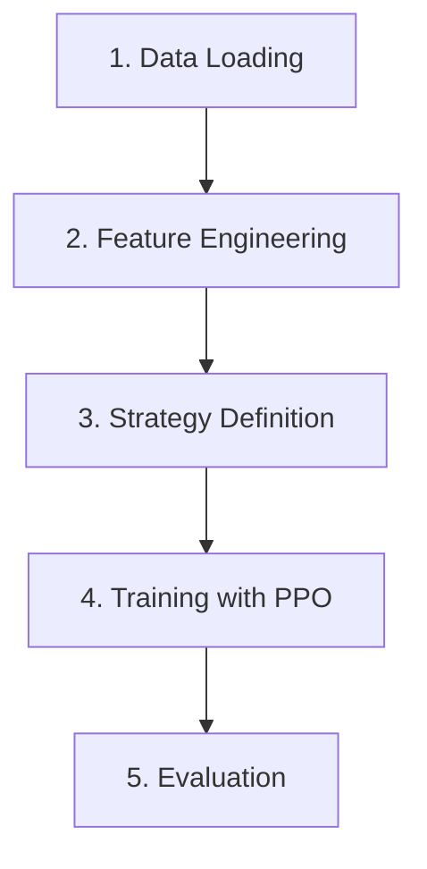

# Quickstart

Train your first trading agent in 5 minutes.

## Basic Example

```python
from quantrl_lab.data.sources.yfinance_loader import YFinanceDataLoader
from quantrl_lab.data.processing.processor import DataProcessor
from quantrl_lab.environments.stock.single import SingleStockTradingEnv
from quantrl_lab.environments.stock.components.config import SingleStockEnvConfig
from quantrl_lab.environments.stock.strategies.actions import StandardActionStrategy
from quantrl_lab.environments.stock.strategies.observations import FeatureAwareObservationStrategy
from quantrl_lab.environments.stock.strategies.rewards import PortfolioValueChangeReward
from stable_baselines3 import PPO

# 1. Load and process data
loader = YFinanceDataLoader()
df = loader.get_historical_ohlcv_data(symbols="AAPL", start="2020-01-01", end="2023-12-31")

processor = DataProcessor(ohlcv_data=df)
df, metadata = processor.data_processing_pipeline(indicators=["SMA", "EMA", "RSI", "MACD"])

# 2. Define strategies
action_strategy = StandardActionStrategy()
observation_strategy = FeatureAwareObservationStrategy()
reward_strategy = PortfolioValueChangeReward()

# 3. Create environment
config = SingleStockEnvConfig(
    initial_balance=10000,
    window_size=20
)

env = SingleStockTradingEnv(
    data=df,
    config=config,
    action_strategy=action_strategy,           # (1)!
    observation_strategy=observation_strategy, # (2)!
    reward_strategy=reward_strategy            # (3)!
)

# 4. Train agent
model = PPO("MlpPolicy", env, verbose=1)
model.learn(total_timesteps=50000)

# 5. Evaluate
obs, info = env.reset()
done = False
total_reward = 0

while not done:
    action, _ = model.predict(obs, deterministic=True)
    obs, reward, terminated, truncated, info = env.step(action)
    total_reward += reward
    done = terminated or truncated

print(f"Total Reward: {total_reward:.2f}")
print(f"Final Portfolio Value: {env.portfolio.total_value:.2f}")
```

1. Decodes a continuous Box(3,) action — [action_type, amount, price_modifier] — into market/limit/stop orders
2. Builds the state vector from a rolling market window + 9 portfolio features (balance ratio, position size, unrealized PnL, volatility, trend, etc.)
3. Calculates the scalar reward signal the agent optimizes for — here, the change in portfolio value each step

## What Just Happened?



1. **Data Loading**: Fetched AAPL historical data from YFinance (free, no API key needed)
2. **Feature Engineering**: Ran `data_processing_pipeline()`, which chains multiple steps — technical indicators (SMA, EMA, RSI, MACD), optional analyst estimates, market context (sector/industry performance), optional news sentiment scoring via HuggingFace, numeric type conversion, column cleanup, NaN row dropping (handles indicator warm-up periods), and optional train/test splitting by ratio or date range. All steps are tracked in the returned `metadata` dict.
3. **Strategy Definition**: Configured how the agent acts, observes, and is rewarded
4. **Training**: Trained an RL agent using PPO — any SB3 algorithm compatible with continuous Box action and observation spaces works here (e.g. PPO, SAC, A2C, TQC). Discrete-action algorithms like DQN are not compatible with `StandardActionStrategy`'s continuous action space. A discrete action strategy is not yet implemented, but can be added by inheriting `BaseActionStrategy` and returning a `gymnasium.spaces.Discrete` space — see [Custom Strategies](../user-guide/custom-strategies.md).
5. **Evaluation**: Ran the trained agent deterministically across multiple episodes, tracking per-step action types, portfolio value, and rewards. Aggregated into financial metrics — return %, win rate, annualised Sharpe ratio, Sortino ratio, and max drawdown — computed from the reconstructed equity curve. Multiple models can also be evaluated side-by-side with `evaluate_multiple_models()` and compared with `compare_model_performance()`.

!!! warning "Use separate test data"
    The example above evaluates on training data for simplicity. Always use a
    train/test split for real experiments. See [Backtesting](../user-guide/backtesting.md).

## Next Steps

### Use BacktestRunner for Experiments

The `BacktestRunner` simplifies training and evaluation:

```python
from quantrl_lab.experiments.backtesting import BacktestRunner
from quantrl_lab.experiments.backtesting.core import ExperimentJob
from stable_baselines3 import PPO

# Assumes df has been processed and split (see Basic Example above)
split_idx = int(len(df) * 0.8)
train_df = df.iloc[:split_idx]
test_df = df.iloc[split_idx:]

# Re-use the same strategies defined in the Basic Example
# action_strategy, observation_strategy, reward_strategy

# Wrap train/test envs into a config object
env_config = BacktestRunner.create_env_config_factory(
    train_data=train_df,
    test_data=test_df,
    action_strategy=action_strategy,
    reward_strategy=reward_strategy,
    observation_strategy=observation_strategy
)

# Define a job: algorithm + env config + run parameters
job = ExperimentJob(
    algorithm_class=PPO,
    env_config=env_config,
    total_timesteps=50000,
    n_envs=4,              # number of parallel envs for training
    num_eval_episodes=3
)

runner = BacktestRunner(verbose=True)
result = runner.run_job(job)

# Inspect results: prints train/test return %, Sharpe, drawdown, top features
BacktestRunner.inspect_result(result)
```

### Try Different Reward Strategies

All built-in reward strategies:

| Class | Import | Description |
|-------|--------|-------------|
| `PortfolioValueChangeReward` | `strategies.rewards` | Raw portfolio value change each step |
| `DifferentialSharpeReward` | `strategies.rewards` | Return scaled by total volatility (Sharpe-based) |
| `DifferentialSortinoReward` | `strategies.rewards` | Return scaled by downside volatility only (Sortino-based) |
| `DrawdownPenaltyReward` | `strategies.rewards` | Penalizes drawdown from portfolio peak |
| `TurnoverPenaltyReward` | `strategies.rewards` | Penalizes excessive trading / high turnover |
| `InvalidActionPenalty` | `strategies.rewards` | Penalizes invalid actions (e.g. selling with no position) |
| `OrderExpirationPenaltyReward` | `strategies.rewards` | Penalizes limit/stop orders that expire unfilled |
| `BoredomPenaltyReward` | `strategies.rewards.boredom` | Penalizes holding a stale position past a grace period |
| `LimitExecutionReward` | `strategies.rewards.execution_bonus` | Rewards price improvement from limit order fills vs market price |
| `CompositeReward` | `strategies.rewards` | Weighted combination of any of the above |

!!! note
    `BoredomPenaltyReward` and `LimitExecutionReward` are not yet exported from the top-level `strategies.rewards` package — import them directly from their modules.

Use `CompositeReward` to blend multiple signals:

```python
from quantrl_lab.environments.stock.strategies.rewards import (
    CompositeReward,
    PortfolioValueChangeReward,
    DifferentialSortinoReward,
    InvalidActionPenalty,
    TurnoverPenaltyReward,
)

reward_strategy = CompositeReward(
    strategies=[
        PortfolioValueChangeReward(),      # (1)!
        DifferentialSortinoReward(),       # (2)!
        InvalidActionPenalty(),            # (3)!
        TurnoverPenaltyReward(),           # (4)!
    ],
    weights=[0.5, 0.3, 0.1, 0.1],
    auto_scale=True  # (5)!
)
```

1. Rewards portfolio value growth each step
2. Return scaled by downside volatility — penalizes losses more than equivalent gains
3. Penalizes invalid actions (e.g. selling with no position held)
4. Penalizes excessive trading to discourage overtrading
5. Normalizes each component to N(0,1) before weighting — recommended when combining strategies with different scales

### Custom Reward Strategies

Extend `BaseRewardStrategy` to define your own signal. Implement `calculate_reward()` and optionally `reset()` for episode state:

```python
from quantrl_lab.environments.core.interfaces import BaseRewardStrategy, TradingEnvProtocol

class DirectionalAccuracyReward(BaseRewardStrategy):
    """Gives a small bonus when the agent trades in the direction of the next price move."""

    def calculate_reward(self, env: TradingEnvProtocol) -> float:
        # Requires at least one future step
        if env.current_step + 1 >= len(env.data):
            return 0.0

        price_col = env.price_column_index
        current_price = env.data[env.current_step, price_col]
        next_price = env.data[env.current_step + 1, price_col]
        price_direction = next_price - current_price

        action_type = getattr(env, "last_action_type", None)

        from quantrl_lab.environments.core.types import Actions
        if action_type == Actions.Buy and price_direction > 0:
            return 0.1
        elif action_type == Actions.Sell and price_direction < 0:
            return 0.1
        return 0.0

    def reset(self):
        pass  # No internal state to reset

# Inject like any built-in strategy
reward_strategy = DirectionalAccuracyReward()

# Or compose with others
reward_strategy = CompositeReward(
    strategies=[DifferentialSortinoReward(), DirectionalAccuracyReward()],
    weights=[0.8, 0.2],
    auto_scale=True
)
```

### Explore Notebooks

Check out the notebooks in the `notebooks/` directory:

- `backtesting_example.ipynb` - Comprehensive workflow
- `feature_selection.ipynb` - Vectorized backtesting
- `optuna_tuning.ipynb` - Hyperparameter optimization

## Learn More

- [Custom Strategies](../user-guide/custom-strategies.md) - Build your own reward/observation strategies
- [Backtesting Guide](../user-guide/backtesting.md) - Advanced backtesting workflows
- [API Reference](../api-reference/environments.md) - Detailed API documentation
