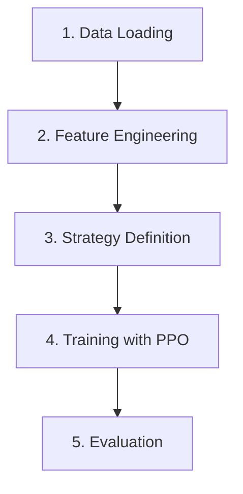

# Quickstart

Train your first trading agent in 5 minutes.

## Basic Example

```python
from quantrl_lab.data.sources.yfinance import YFinanceDataLoader

from quantrl_lab.data.sources.yfinance import YFinanceDataLoader
from quantrl_lab.data.processing.processor import DataProcessor
from quantrl_lab.environments.stock.env_single_stock import SingleStockTradingEnv
from quantrl_lab.environments.stock.stock_config import StockTradingConfig
from quantrl_lab.environments.stock.strategies.actions import StandardMarketActionStrategy
from quantrl_lab.environments.stock.strategies.observations import PortfolioWithTrendObservation
from quantrl_lab.environments.stock.strategies.rewards import PortfolioValueChangeReward
from stable_baselines3 import PPO

# 1. Load and process data
loader = YFinanceDataLoader()
df = loader.fetch_data(symbol="AAPL", start_date="2020-01-01", end_date="2023-12-31")

processor = DataProcessor(ohlcv_data=df)
df, metadata = processor.data_processing_pipeline(indicators=["SMA", "EMA", "RSI", "MACD"])

# 2. Define strategies
action_strategy = StandardMarketActionStrategy()
observation_strategy = PortfolioWithTrendObservation()
reward_strategy = PortfolioValueChangeReward()

# 3. Create environment
config = StockTradingConfig(
    initial_balance=10000,
    transaction_cost_pct=0.001,
    window_size=20
)

env = SingleStockTradingEnv(
    data=df,
    config=config,
    action_strategy=action_strategy,          # (1)!
    observation_strategy=observation_strategy, # (2)!
    reward_strategy=reward_strategy            # (3)!
)

# 4. Train agent
model = PPO("MlpPolicy", env, verbose=1)
model.learn(total_timesteps=50000)

# 5. Evaluate
obs, info = env.reset()
done = False
total_reward = 0

while not done:
    action, _ = model.predict(obs, deterministic=True)
    obs, reward, terminated, truncated, info = env.step(action)
    total_reward += reward
    done = terminated or truncated

print(f"Total Reward: {total_reward:.2f}")
print(f"Final Portfolio Value: {env.portfolio.total_value:.2f}")
```

1. Maps raw agent actions (0/1/2) to hold/buy/sell decisions
2. Builds the state vector the agent sees (portfolio + technical indicators)
3. Calculates the scalar reward signal the agent optimizes for

## What Just Happened?



1. **Data Loading**: Fetched AAPL historical data from YFinance (free, no API key needed)
2. **Feature Engineering**: Added technical indicators (SMA, EMA, RSI, MACD)
3. **Strategy Definition**: Configured how the agent acts, observes, and is rewarded
4. **Training**: Used PPO algorithm to learn optimal trading policy
5. **Evaluation**: Tested the trained agent on the same data (in practice, use separate test data)

!!! warning "Use separate test data"
    The example above evaluates on training data for simplicity. Always use a
    train/test split for real experiments. See [Backtesting](../user-guide/backtesting.md).

## Next Steps

### Use BacktestRunner for Experiments

The `BacktestRunner` simplifies training and evaluation:

```python
from quantrl_lab.experiments.backtesting import BacktestRunner
from stable_baselines3 import PPO, SAC, A2C

# Create environment config factory
env_config = BacktestRunner.create_env_config_factory(
    train_data=train_df,
    test_data=test_df,
    action_strategy=action_strategy,
    reward_strategy=reward_strategy,
    observation_strategy=observation_strategy
)

# Run single experiment
runner = BacktestRunner(verbose=1)
results = runner.run_single_experiment(
    PPO,
    env_config,
    total_timesteps=50000,
    num_eval_episodes=3
)

# Inspect results
BacktestRunner.inspect_single_experiment(results)
```

### Try Different Reward Strategies

```python
from quantrl_lab.environments.stock.strategies.rewards import (
    TrendFollowingReward,
    WeightedCompositeReward,
    PortfolioValueChangeReward,
    InvalidActionPenalty
)

# Combine multiple reward components
reward_strategy = WeightedCompositeReward(
    components=[
        PortfolioValueChangeReward(),  # (1)!
        TrendFollowingReward(),        # (2)!
        InvalidActionPenalty()         # (3)!
    ],
    weights=[0.5, 0.3, 0.2]
)
```

1. Rewards portfolio value growth
2. Rewards trading in the direction of the trend
3. Penalizes invalid actions (e.g. selling when no position)

### Explore Notebooks

Check out the notebooks in the `notebooks/` directory:

- `backtesting_example.ipynb` - Comprehensive workflow
- `feature_selection.ipynb` - Vectorized backtesting
- `optuna_tuning.ipynb` - Hyperparameter optimization

## Learn More

- [Custom Strategies](../user-guide/custom-strategies.md) - Build your own reward/observation strategies
- [Backtesting Guide](../user-guide/backtesting.md) - Advanced backtesting workflows
- [API Reference](../api-reference/environments.md) - Detailed API documentation
