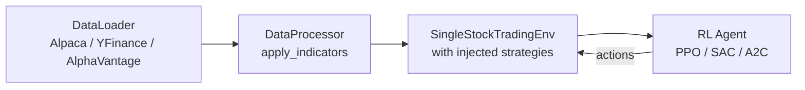

## Key Features

-   :material-puzzle-outline:{ .lg .middle } **Pluggable Strategy System**

    ---

    Inject custom action, observation, and reward strategies without
    modifying environment code.

    [:octicons-arrow-right-24: Custom Strategies](user-guide/custom-strategies.md)

-   :material-chart-line:{ .lg .middle } **Comprehensive Backtesting**

    ---

    Train and evaluate RL algorithms against historical data with
    detailed performance metrics.

    [:octicons-arrow-right-24: Backtesting Guide](user-guide/backtesting.md)

-   :material-cog-outline:{ .lg .middle } **Feature Engineering**

    ---

    Vectorized backtesting, technical indicator analysis, and an
    auto-registered indicator registry.

    [:octicons-arrow-right-24: Feature Engineering](examples/feature-engineering.md)

-   :material-tune:{ .lg .middle } **Hyperparameter Tuning**

    ---

    Optuna integration for automated optimization of RL agents
    and trading strategies.

    [:octicons-arrow-right-24: Tuning Guide](examples/hyperparameter-tuning.md)

-   :material-bank-outline:{ .lg .middle } **Multi-Asset Support**

    ---

    Single-stock, crypto, and forex environments with shared
    interfaces and pluggable data sources.

    [:octicons-arrow-right-24: Environments API](api-reference/environments.md)

-   :material-rocket-launch-outline:{ .lg .middle } **Live Trading**

    ---

    Alpaca integration for paper and live trading with the same
    strategies you trained on.

    [:octicons-arrow-right-24: Get Started](getting-started/quickstart.md)

## Architecture at a Glance

!!! tip "Quick Start"
    Install with `uv sync` and train your first agent in a few lines of code.
    See the [Quickstart Guide](getting-started/quickstart.md) for a walkthrough.
