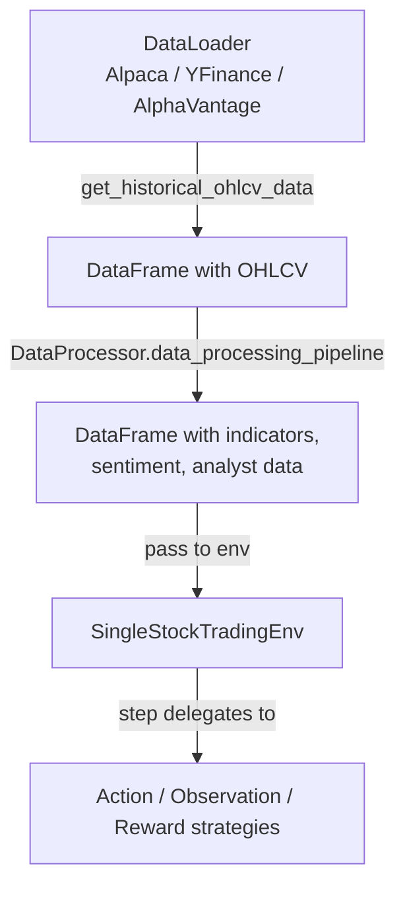
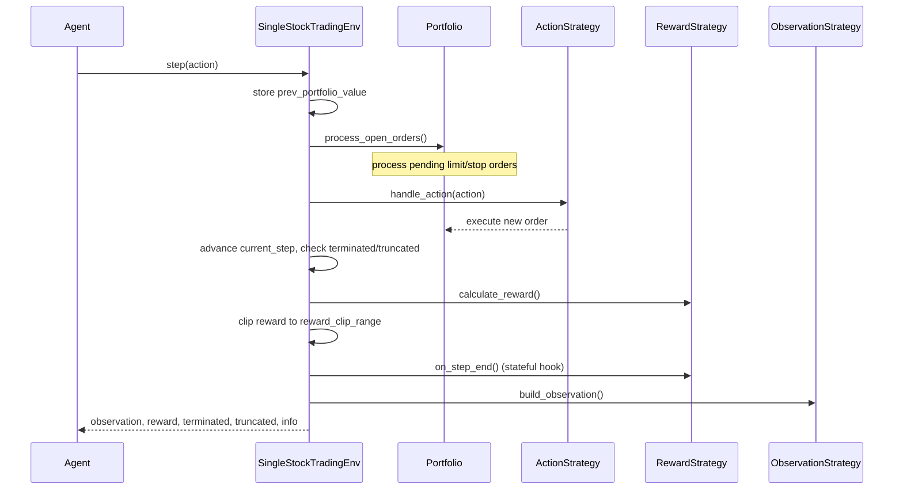

# User Guide Overview

Welcome to the QuantRL-Lab user guide. This section covers core concepts and practical workflows for building and testing trading strategies.

## Core Concepts

### Strategy Injection

QuantRL-Lab uses **dependency injection** to decouple environment logic from strategies:

```python
env = SingleStockTradingEnv(
    data=df,
    config=config,
    action_strategy=action_strategy,          # (1)!
    reward_strategy=reward_strategy,          # (2)!
    observation_strategy=observation_strategy  # (3)!
)
```

1. How raw actions are mapped to market orders
2. How scalar rewards are calculated each step
3. What the agent sees as its state representation

This architecture enables:

- **Modularity**: Change reward functions without touching environment code
- **Reusability**: Compose complex behaviors from simple components
- **Testability**: Isolate and test strategies independently
- **Experimentation**: Rapidly iterate on different configurations

### Three Strategy Types

=== "Action Strategy"

    Defines how raw agent actions are processed into market orders.

    ```python
    from quantrl_lab.environments.stock.strategies.actions import StandardActionStrategy

    action_strategy = StandardActionStrategy()
    # Continuous Box space: [action_type, amount, price_modifier]
    # Supports: Hold, Buy, Sell, LimitBuy, LimitSell, StopLoss, TakeProfit
    ```

=== "Observation Strategy"

    Constructs the state representation the agent sees.

    ```python
    from quantrl_lab.environments.stock.strategies.observations import FeatureAwareObservationStrategy

    observation_strategy = FeatureAwareObservationStrategy()
    # Returns: flattened market window + 9 portfolio/engineering features
    ```

=== "Reward Strategy"

    Calculates reward signals for reinforcement learning.

    ```python
    from quantrl_lab.environments.stock.strategies.rewards import PortfolioValueChangeReward

    reward_strategy = PortfolioValueChangeReward()
    # Reward = change in portfolio value
    ```

## Data Flow



## Step Execution Order

Each call to `env.step(action)` follows this sequence:



## Configuration & Non-Obvious Behaviors

See [Configuration](../getting-started/configuration.md) for all `SingleStockEnvConfig` / `SimulationConfig` parameters. For subtle runtime behaviors (step timing, window padding, price auto-detection, order persistence), see [Architecture — Non-Obvious Behaviours](../ARCHITECTURE.md#non-obvious-behaviours).

## Backtesting Workflow

For a complete training + evaluation workflow, see [Backtesting](backtesting.md) and [Experiments](../experiments.md).

## Advanced Topics

- [Custom Strategies](custom-strategies.md) - Build custom action/observation/reward strategies
- [Backtesting](backtesting.md) - Advanced backtesting workflows and metrics
- [Reward Shaping](reward_shaping.md) - Techniques for stable, informative reward signals

## Next Steps

- Explore [examples](../examples/basic-backtest.md) for complete workflows
- Check [API reference](../api-reference/environments.md) for detailed documentation
- Review notebooks in `notebooks/` for interactive tutorials
