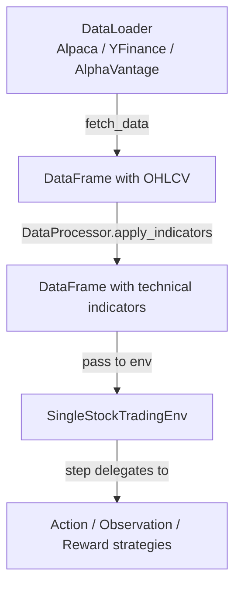
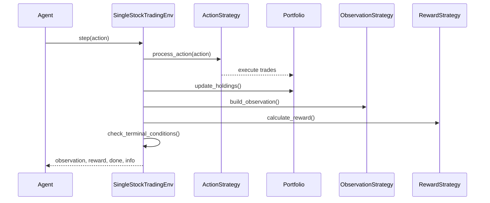

# User Guide Overview

Welcome to the QuantRL-Lab user guide. This section covers core concepts and practical workflows for building and testing trading strategies.

## Core Concepts

### Strategy Injection

QuantRL-Lab uses **dependency injection** to decouple environment logic from strategies:

```python
env = SingleStockTradingEnv(
    data=df,
    config=config,
    action_strategy=action_strategy,          # (1)!
    reward_strategy=reward_strategy,          # (2)!
    observation_strategy=observation_strategy  # (3)!
)
```

1. How raw actions are mapped to market orders
2. How scalar rewards are calculated each step
3. What the agent sees as its state representation

This architecture enables:

- **Modularity**: Change reward functions without touching environment code
- **Reusability**: Compose complex behaviors from simple components
- **Testability**: Isolate and test strategies independently
- **Experimentation**: Rapidly iterate on different configurations

### Three Strategy Types

=== "Action Strategy"

    Defines how raw agent actions are processed into market orders.

    ```python
    from quantrl_lab.environments.stock.strategies.actions import StandardMarketActionStrategy

    action_strategy = StandardMarketActionStrategy()
    # Actions: 0=hold, 1=buy, 2=sell
    ```

=== "Observation Strategy"

    Constructs the state representation the agent sees.

    ```python
    from quantrl_lab.environments.stock.strategies.observations import PortfolioWithTrendObservation

    observation_strategy = PortfolioWithTrendObservation()
    # Returns: portfolio state + technical indicators
    ```

=== "Reward Strategy"

    Calculates reward signals for reinforcement learning.

    ```python
    from quantrl_lab.environments.stock.strategies.rewards import PortfolioValueChangeReward

    reward_strategy = PortfolioValueChangeReward()
    # Reward = change in portfolio value
    ```

## Data Flow



## Step Execution Order

Each call to `env.step(action)` follows this sequence:



## Environment Configuration

```python
from quantrl_lab.environments.stock.stock_config import StockTradingConfig

config = StockTradingConfig(
    initial_balance=10000,        # Starting capital
    transaction_cost_pct=0.001,   # 0.1% per trade
    window_size=20,               # Lookback period
    max_shares_per_trade=100,     # Position sizing limit
    enable_shorting=False         # Allow short positions
)
```

!!! note "Non-obvious behaviors"
    - `current_step` is **0-indexed** into the data array
    - `window_size` determines the lookback for observations
    - Portfolio resets to `initial_balance` on `reset()` but keeps transaction history
    - Price column is auto-detected: searches `close`, `Close`, `adj_close`, or the 4th column

## Backtesting Workflow

### 1. Data Preparation
```python
from quantrl_lab.data.sources.yfinance import YFinanceDataLoader
from quantrl_lab.data.processors.processor import DataProcessor

loader = YFinanceDataLoader()
df = loader.fetch_data(symbol="AAPL", start_date="2020-01-01", end_date="2023-12-31")

processor = DataProcessor()
df = processor.apply_indicators(df, indicators=["SMA", "EMA", "RSI"])
```

### 2. Train/Test Split
```python
split_idx = int(len(df) * 0.8)
train_df = df[:split_idx]
test_df = df[split_idx:]
```

### 3. Strategy Definition
```python
from quantrl_lab.environments.stock.strategies import (
    StandardMarketActionStrategy,
    PortfolioWithTrendObservation,
    WeightedCompositeReward
)

action_strategy = StandardMarketActionStrategy()
observation_strategy = PortfolioWithTrendObservation()
reward_strategy = WeightedCompositeReward.from_preset("balanced")
```

### 4. Training
```python
from quantrl_lab.experiments.backtesting import BacktestRunner
from stable_baselines3 import PPO

env_config = BacktestRunner.create_env_config_factory(
    train_data=train_df,
    test_data=test_df,
    action_strategy=action_strategy,
    observation_strategy=observation_strategy,
    reward_strategy=reward_strategy
)

runner = BacktestRunner(verbose=1)
results = runner.run_single_experiment(
    PPO,
    env_config,
    total_timesteps=50000,
    num_eval_episodes=3
)
```

### 5. Evaluation
```python
BacktestRunner.inspect_single_experiment(results)
# Displays: final portfolio value, Sharpe ratio, max drawdown, win rate
```

## Advanced Topics

- [Custom Strategies](custom-strategies.md) - Build custom action/observation/reward strategies
- [Backtesting](backtesting.md) - Advanced backtesting workflows and metrics
- [Feature Engineering](../examples/feature-engineering.md) - Vectorized strategy analysis
- [Hyperparameter Tuning](../examples/hyperparameter-tuning.md) - Optuna optimization

## Next Steps

- Explore [examples](../examples/basic-backtest.md) for complete workflows
- Check [API reference](../api-reference/environments.md) for detailed documentation
- Review notebooks in `notebooks/` for interactive tutorials
